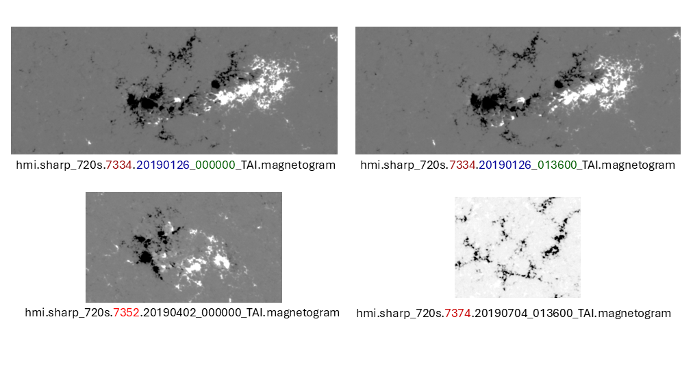

# Solar-Flare-Dataset-2019-2025

A solar active-region magnetogram dataset based on HMI SHARP 720s observations from 2019 to 2025.

## Overview

Solar flares, often accompanied by energetic charged particles and electromagnetic radiation, can affect radio communication, Global Positioning System (GPS) accuracy, satellite operations, and astronaut safety within several minutes. Therefore, developing reliable solar flare forecasting methods is important for modern society, which is increasingly supported by high-tech systems.

Solar flares are closely related to the sudden release of stored magnetic energy in the solar corona. Observed photospheric magnetic fields, including magnetogram images and magnetic parameters of sunspot groups, are widely used as inputs for solar flare forecasting models.

To complement existing studies that mainly rely on datasets from earlier solar-cycle periods or 2011–2019 data, this repository provides a new HMI SHARP magnetogram dataset covering 2019–2025. The dataset includes HMI SHARP magnetogram FITS files and daily metadata CSV files containing detailed SHARP keyword information and magnetic parameters.

## Data Source

The raw data are obtained from the Joint Science Operations Center (JSOC) using the `hmi.sharp_720s` data series. SHARP stands for Space-weather HMI Active Region Patch. Each SHARP record corresponds to an automatically identified solar active-region patch rather than a full-disk solar image.

The original `hmi.sharp_720s` data series has a 720-second cadence. In this repository, we download and release the `magnetogram` segment from the `hmi.sharp_720s` series. The `magnetogram` segment provides HARP-sized line-of-sight magnetogram data.

This dataset should be regarded as a curated and sampled subset of the official HMI SHARP data rather than a replacement for JSOC.

## Dataset Coverage

- Time range: `2019-01-26` to `2025-12-30`
- Total coverage: 2,530 days
- Data series: `hmi.sharp_720s`
- Segment: `magnetogram`
- Data type: solar active-region magnetogram patches
- File format:
  - FITS files for magnetograms
  - CSV files for daily metadata
- Sampling strategy: one SHARP record sampled every 96 minutes for each active region when available

Note: The original `hmi.sharp_720s` series has a 720-second cadence, while this dataset is sampled at a 96-minute interval to reduce storage and computational cost.

## Directory Structure

```text
Solar-Flare-Dataset-2019-2025/
├── README.md
├── scripts/
│   ├── download_hmi_sharp.py
│   ├── build_flare_labels.py
│   └── fits_to_png.py
├── magnetogram/
│   ├── 20190126/
│   │   ├── hmi.sharp_720s.7334.20190126_000000_TAI.magnetogram.fits
│   │   ├── hmi.sharp_720s.7334.20190126_013600_TAI.magnetogram.fits
│   │   └── hmi_sharp_720s_20190126.csv
│   ├── 20190127/
│   │   └── ...
│   └── ...
└── labels/
    └── flare_labels_M1_from_noaa_events.csv
```

If the full FITS files are too large for GitHub, we recommend storing them on Zenodo, Hugging Face Datasets, Google Drive, or another data-hosting platform, and keeping only scripts, metadata examples, and download instructions in this repository.

## Data Format

### Magnetogram FITS Files

Each magnetogram file follows the naming convention:

```text
hmi.sharp_720s.<HARPNUM>.<YYYYMMDD_HHMMSS>_TAI.magnetogram.fits
```

where:

- `<HARPNUM>` is the HMI Active Region Patch number, representing the tracked solar active-region patch.
- `<YYYYMMDD_HHMMSS>` is the observation time in TAI.
- `magnetogram` indicates the line-of-sight magnetogram segment.

Example:

```text
hmi.sharp_720s.7334.20190126_000000_TAI.magnetogram.fits
hmi.sharp_720s.7334.20190126_013600_TAI.magnetogram.fits
```

Adjacent records from the same active region are sampled approximately every 96 minutes in this dataset. Different active regions may have different spatial sizes, so users should resize, pad, crop, or interpolate images before training image-based deep learning models.

### Daily Metadata CSV Files

Each daily CSV file is generated from the JSOC query result for one day. Each row corresponds to one SHARP record indexed mainly by `T_REC` and `HARPNUM`.

Example file:

```text
hmi_sharp_720s_20190126.csv
```

Important columns include:

| Column | Description |
|---|---|
| `T_REC` | Record time of the SHARP observation, usually in TAI |
| `T_OBS` | Observation time |
| `HARPNUM` | HMI Active Region Patch number |
| `NOAA_AR` / `NOAA_ARS` | Associated NOAA active region number(s), if available |
| `QUALITY` | Data quality flag |
| `USFLUX` | Total unsigned magnetic flux |
| `TOTUSJH` | Total unsigned current helicity |
| `TOTUSJZ` | Total unsigned vertical current |
| `ABSNJZH` | Absolute value of net current helicity |
| `SAVNCPP` | Sum of absolute net current per polarity |
| `TOTPOT` | Total photospheric magnetic free energy density |
| `MEANPOT` | Mean photospheric excess magnetic energy density |
| `MEANSHR` | Mean shear angle |
| `SHRGT45` | Area with shear angle greater than 45 degrees |
| `R_VALUE` | Total unsigned flux around high-gradient polarity inversion lines |
| `AREA_ACR` | Area of strong-field pixels in the active region |
| `magnetogram` | JSOC/SUMS path of the corresponding magnetogram FITS segment |

The CSV files can be used as metadata tables for linking magnetogram FITS files with active-region identifiers, observation times, physical magnetic parameters, data-quality flags, and future flare labels.

For tabular machine learning models, users may directly use selected SHARP magnetic parameters from the CSV files. For image-based deep learning models, users may use the FITS magnetogram files as image inputs and use the CSV files for metadata and label matching.


## Acknowledgement

The raw HMI SHARP data are provided by the Joint Science Operations Center (JSOC) and the Solar Dynamics Observatory / Helioseismic and Magnetic Imager (SDO/HMI) team. The solar event reports used for label construction are provided by NOAA Space Weather Prediction Center (SWPC).

If you use this dataset, please acknowledge JSOC, SDO/HMI, and NOAA SWPC as the original data providers.

## Citation

If you use this dataset or the accompanying scripts, please cite this repository:

```bibtex
@misc{chang2026solarflaredataset,
  title        = {Solar-Flare-Dataset-2019-2025},
  author       = {Chang, Yi},
  year         = {2026},
  howpublished = {\url{https://github.com/ICYEEyudie/Solar-Flare-Dataset-2019-2025}},
  note         = {HMI SHARP magnetogram dataset for solar flare forecasting}
}
```

Please also cite the original data providers and relevant HMI/SHARP documentation when appropriate.

## License

Please specify the license before using or redistributing this dataset.

Suggested options:

- Code: MIT License
- Dataset metadata and documentation: CC BY 4.0
- Raw HMI SHARP data: subject to the usage policies of JSOC and SDO/HMI data providers
